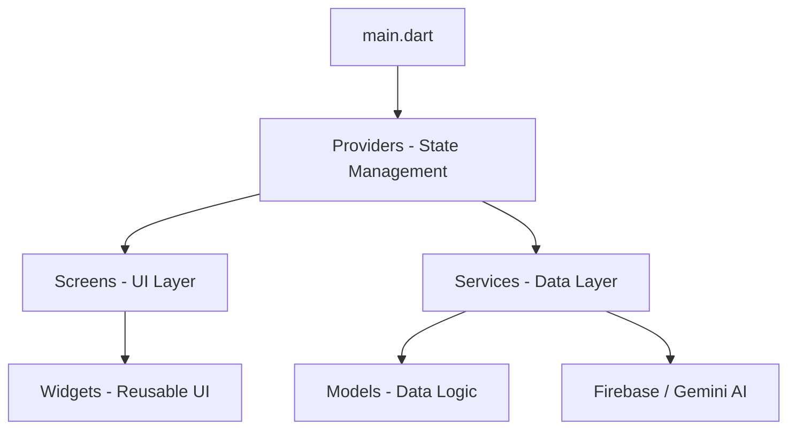

# biZEase Project Overview

**biZEase** is a modern Flutter-based e-commerce platform designed for both business owners and customers. This document explains the project structure, the purpose of each file, and how they interact.

## 🏗️ Architecture & Connections

The project follows a **Provider-based Architecture** with a clear separation of concerns:

1.  **Entry Point**: `main.dart` initializes Firebase and wraps the entire application in a `MultiProvider` to make state (cart, auth, etc.) accessible everywhere.
2.  **UI Layer (`lib/screens`)**: The visual part of the app. Screens observe `Providers` for data changes and user interactions.
3.  **State Management (`lib/screens/*_provider.dart`)**: These files (contained within the screens folder) manage the logic of the app (e.g., adding to cart, logging in).
4.  **Data Layer (`lib/services`)**: These files handle raw communication with external APIs like Firebase Firestore, Firebase Auth, and Google Gemini AI.
5.  **Entities (`lib/models`)**: Blueprint classes that define what a "Product", "Order", or "User" looks like in the app.

---

## 📁 File Breakdown

### 📍 Core Files
| File | Description |
| :--- | :--- |
| `lib/main.dart` | Entry point. Sets up routing (`/home`, `/login`), themes, and global state providers. |
| `lib/api_key.dart` | Stores the API key for Google Gemini AI. |
| `lib/firebase_options.dart` | Auto-generated configuration for connecting to your specific Firebase project. |

### 📦 Models (`lib/models/`)
*These files represent the "nouns" of your project.*
- `product_model.dart`: Fields like price, description, images, and category.
- `order_model.dart`: Tracking order status (pending/delivered), customer details, and totals.
- `customer_model.dart` & `owner_model.dart`: User profiles with specific fields for each type.
- `cart_item.dart`, `wishlist_model.dart`, `notification_model.dart`: Specific data units for those features.

### 🖼️ Screens & State (`lib/screens/`)
*The "brains" and "beauty" of the app.*
- **Auth Flow**: `login_business.dart`, `signup_customer.dart`, `splash_screen.dart`, `welcome_page.dart`.
- **Customer Flow**: `home_page.dart`, `cart_page.dart`, `product_details_page.dart`, `wishlist_page.dart`.
- **Owner Flow**: `owner_dashboard_page.dart` (Stats), `add_new_product_page.dart`, `owner_orders_page.dart`.
- **Providers**: `auth_provider.dart`, `cart_provider.dart`, `order_provider.dart`, etc. (These bridge the UI and Services).

### 🛠️ Services (`lib/services/`)
*The "engine room" connecting to the internet.*
- `ai_service.dart`: Sends prompts to Gemini AI to generate business insights or captions.
- `product_service.dart`: CRUD operations (Create, Read, Update, Delete) for products in Firestore.
- `firebase_auth_service.dart`: Handles registration and login logic at the Firebase level.
- `storage_service.dart`: Uploads and retrieves images from Firebase Storage.

### 🎨 Widgets & Utils (`lib/widgets/` & `lib/utils/`)
*Reusable tools.*
- `business_insights_card.dart`: A specialized UI component for displaying AI-generated data.
- `navigation_service.dart`: A helper to navigate between pages without needing a direct "Context".

---

## 🔗 How it works together (Example Flow)
1.  **User adds a product**:
    - User clicks "Add to Cart" in `product_details_page.dart`.
    - The screen calls `CartProvider.addItem()`.
    - `CartProvider` updates its internal list and notifies the UI.
    - `cart_page.dart` automatically updates to show the new item.
2.  **Owner gets Insights**:
    - `OwnerDashboardPage` calls `AIService.generateBusinessInsights()`.
    - `AIService` uses the key in `api_key.dart` to talk to Google's servers.
    - The result is sent back and displayed in a `BusinessInsightsCard`.
